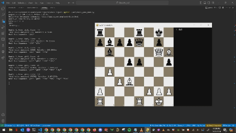

# Chess Engine

This repository contains a ~2100 Elo chess engine developed with a Rust backend and Python frontend by Steven Brown. Click the [DOWNLOAD LINK](https://stevenb4.itch.io/chess-game) then unzip and run the executable to play against the engine!

## Features

- Python GUI
- [Bitboard](https://www.chessprogramming.org/Bitboards) Game Board Representation
- Pre-calculated BitBoard Masks
- Sliding Piece Attack Squares Algorithm
- Encoding Moves as String
- Recursive Move Making Approach
- [Perf Testing](https://www.chessprogramming.org/Perft)
- [Negated Minimax Search](https://www.chessprogramming.org/Negamax) With [Alpha Beta Pruning](https://www.chessprogramming.org/Alpha-Beta)
- [Quiescence Search](https://www.chessprogramming.org/Quiescence_Search)
- [MVVLVA](https://www.chessprogramming.org/MVV-LVA) Move Ordering
- PV/[Killer](https://www.chessprogramming.org/Killer_Heuristic)/[History](https://www.chessprogramming.org/History_Heuristic) Move Ordering
- [Principle Variation (PV) Search](https://www.chessprogramming.org/Principal_Variation_Search) & [Triangular PV-Table](https://www.chessprogramming.org/Triangular_PV-Table#:~:text=A%20Triangular%20PV%2DTable%20is,propagated%20up%20to%20the%20root.)
- [LMR](https://www.chessprogramming.org/Late_Move_Reductions) (Late Move Reduction)
- [Iterative Deepening](https://www.chessprogramming.org/Iterative_Deepening)
- Repetition Detection
- [Transposition Table](https://www.chessprogramming.org/Transposition_Table) (100 MB)
- [Zobrist Hashing](https://www.chessprogramming.org/Zobrist_Hashing)
- Isolated/Passed/Doubled Pawn Evaluation
- King Saftey Evaluation
- Open / Semi-Open File Evaluation
- [Opening Book](https://www.chessprogramming.org/Opening_Book)

## Documentation

More in-depth feature documentation can be found on my [website](https://steven141.github.io/chess.html).

## Demo

